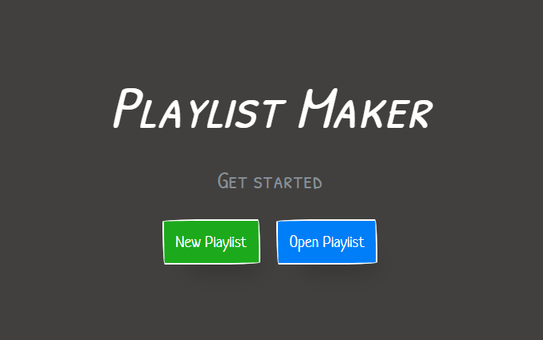
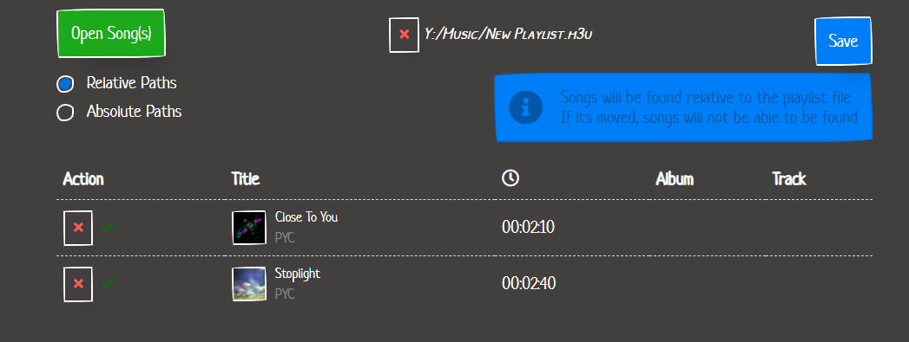

# Playlist Maker 
Creates `.m3u`/`.m3u8` Playlists from music files like `.mp3`, `.wav`, etc..

> Try the [Web Demo](https://deniszholob.github.io/playlist-maker/) 
> If you would like to contribute to the code, see [contributing details](CONTRIBUTING.md)

# Installation 
* Download the [Latest Release](https://github.com/deniszholob/playlist-maker/releases/latest) under the `Assets` dropdown.
* Run the installer.
* Open the app.

# [Support Me](https://www.patreon.com/deniszholob)
If you find the app or the source code useful, consider supporting me on [Patreon](https://www.patreon.com/deniszholob).

# Screenshots

